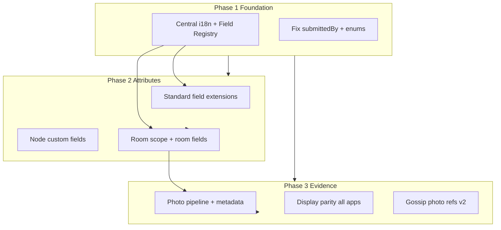

# Product Proposal: Languages, Attributes, Photos & Room Audits

**Status:** Draft  
**Last updated:** 2026-06-15  
**Scope:** node, field-kit, lens, agency-demo, and shared packages (`core`, `ui`, `sdk`, `ai-agent`)

---

## Executive summary

WikiTraveler today is **English-only**, uses a **flat 12-field accessibility catalogue** at property level, stores **up to 3 photos per audit** (Field Kit and Lens only), and has **no room-level model**. This document proposes a coherent path to:

1. **Multilingual UI** across all apps (and optionally multilingual property data)
2. **Extensible property attributes** — standard fields plus node-defined custom fields
3. **Higher-quality photo evidence** — capture, storage, display, and federation
4. **Room type and description in audits** — inventory and per-room-type accessibility

**Recommended delivery:** three phases over roughly 12–16 weeks, with schema and catalogue changes in Phase 1 so later work builds on stable foundations.

---

## Current baseline

| Area | Today | Main gap |
|------|--------|----------|
| **Language** | Hardcoded English; `lang="en"` in layouts; field labels duplicated in 6+ files | No locale preference, no translation layer |
| **Attributes** | `AccessibilityFact` key-value; 12 canonical fields in `packages/core/src/types.ts` | No custom field registry; OSM fields like `tactile_paving` ingested but not in UI |
| **Photos** | Max 3; data-URI → optional R2/Supabase; shown in Field Kit + Lens | Node dashboard and SDK widget omit photos; photos do not gossip |
| **Rooms** | None in schema or forms | Only property-level facts; `accessible_bathroom` ≠ room inventory |

### Apps and packages in scope

| App / package | Path | Role |
|---------------|------|------|
| **node** | `apps/node` | Next.js node: REST API, map, property audit UI, gossip |
| **field-kit** | `apps/field-kit` | Mobile PWA for on-site auditors |
| **lens** | `apps/lens` | Chrome MV3 extension |
| **lens-demo** | `apps/lens-demo` | Static Lens demo |
| **agency-demo** | `apps/agency-demo` | Static SDK integration demo |
| **core** | `packages/core` | Types, tier merge, `ACCESSIBILITY_FIELDS` |
| **ui** | `packages/ui` | Shared toolbar, search filters, theme |
| **sdk** | `packages/sdk` | Browser SDK + embeddable widget |
| **ai-agent** | `packages/ai-agent` | GPT vision + gap-fill |

### Canonical audit fields today

Defined in `packages/core/src/types.ts` (`ACCESSIBILITY_FIELDS`, 12 fields):

`door_width_cm`, `ramp_present`, `elevator_present`, `elevator_floor_count`, `quiet_hours_start`, `quiet_hours_end`, `accessible_bathroom`, `hearing_loop`, `braille_signage`, `step_free_entrance`, `parking_accessible`, `notes`

Labels are duplicated in Field Kit, node, Lens, SDK, and map popup code paths.

### Known technical debt (address in Phase 1)

| Issue | Impact | Location |
|-------|--------|----------|
| `submittedBy` always null on audit POST | CONFIRMED tier never promotes from human audits | `apps/node/app/api/properties/[id]/accessibility/route.ts` |
| `SourceType` missing `OSM` in core | Type drift vs Prisma | `packages/core/src/types.ts` |
| `auditorToken` on `AuditSubmission` never populated | Dead schema field | `prisma/schema.prisma` |
| `tactile_paving` ingested from OSM | Orphan facts not in catalogue | `apps/node/lib/overpass.ts` |

---

## Pillar 1 — Language options across all apps

### Goal

Auditors, travelers, and agency embeds can use the product in their preferred language, starting with **UI strings** and expanding to **property display names** where data exists.

### Design principles

- **Separate UI locale from data locale** — field labels translate; fact values (`yes`, `90`, free-text notes) stay as submitted unless we add explicit multilingual property names.
- **Single source of truth for labels** — consolidate before translating (today: Field Kit, node, Lens, SDK, map popup, core).
- **Progressive rollout** — Next.js apps first; Lens and agency-demo via shared JSON catalog.

### Recommended stack

| Surface | Approach |
|---------|----------|
| **node**, **field-kit** | `next-intl` (App Router) or `@wikitraveler/i18n` package with JSON catalogs |
| **lens**, **agency-demo** | Shared `packages/i18n` — `t(key, locale)` + bundled locale files |
| **sdk widget** | `locale` option on init + `data-wt-locale` attribute |

### Locale resolution (priority order)

1. User setting (`wt_locale` in localStorage / cookie — same pattern as `wt_node_url`)
2. Browser `Accept-Language`
3. Node default (`NODE_DEFAULT_LOCALE` env, e.g. `nl` for Netherlands nodes)
4. Fallback: `en`

Set `<html lang>` dynamically from the resolved locale.

### Data i18n (Phase 1b, optional)

- **Property names:** keep `name` as primary; add `PropertyTranslation { propertyId, locale, name, location }` or JSON `names: { en, nl, de }` for OSM/Wikidata imports.
- **OSM ingest:** prefer `name:{locale}` based on node region, not only `name:en` (`apps/node/lib/overpass.ts`).

### Initial locales (suggested)

| Priority | Locale | Rationale |
|----------|--------|-----------|
| P0 | `en` | Default |
| P1 | `nl` | Netherlands dev/seed focus |
| P2 | `de`, `fr` | Common EU travel markets |

### Per-app work

| App | Work |
|-----|------|
| **packages/core + ui** | `getFieldLabel(fieldName, locale)`, tier/source labels |
| **field-kit** | Settings tab language picker; audit/search labels |
| **node** | Map, stats, property page, admin panels |
| **lens** | Popup + options page |
| **agency-demo / sdk** | Widget strings + docs |
| **ai-agent** | Optional “respond in {locale}” for AI-generated descriptive text only |

### Success metrics

- No user-facing strings outside i18n files (enforce with lint rule).
- `<html lang>` matches active locale.
- Lighthouse / axe: no `lang` mismatch on audited pages.

---

## Pillar 2 — Extended property attributes (including custom)

### Goal

Support **more standard accessibility dimensions** and **node-specific custom fields** without breaking gossip merge or SDK contracts.

### Model options

**Option A — Flat facts only (minimal change)**  
Keep `AccessibilityFact(fieldName, value)`; allow any `fieldName` with a **Field Registry** table.

**Option B — Registry + scoped facts (recommended)**

```prisma
model FieldDefinition {
  id          String   @id @default(cuid())
  fieldName   String   @unique   // snake_case stable key
  scope       FieldScope  // PROPERTY | ROOM
  valueType   ValueType   // BOOLEAN | NUMBER | TEXT | TIME | ENUM
  enumValues  String[]    // optional
  labels      Json        // { "en": "Door width", "nl": "Deurbreedte" }
  unit        String?
  nodeId      String?     // null = global standard; set = node custom
  active      Boolean  @default(true)
}

enum FieldScope { PROPERTY ROOM }
enum ValueType { BOOLEAN NUMBER TEXT TIME ENUM }
```

Facts remain in `AccessibilityFact` with optional scope:

```prisma
// Add to AccessibilityFact:
scopeKey   String  @default("property")  // "property" | "room-type:double" | "room-type:accessible_king"
```

**Option C — JSON attribute bag on Property**  
Fast for custom metadata; poor for tier merge, search, and gossip — **not recommended** for accessibility truth.

### Standard field extensions (Phase 2)

| Field | Type | Notes |
|-------|------|-------|
| `tactile_paving` | boolean | Already ingested from OSM |
| `roll_in_shower` | boolean | |
| `grab_bars_bathroom` | boolean | |
| `bed_height_cm` | number | Room-relevant |
| `turning_circle_cm` | number | |
| `pool_lift` | boolean | |
| `service_animal_policy` | text | |

### Custom fields (node admin)

- Admin UI: **Settings → Custom fields** — define name, type, labels, scope.
- **Gossip v1:** custom fields local-only; global fields gossip.
- **Gossip v2:** namespace custom fields as `custom:{nodeId}:{name}` if federation is required.

### API changes

- `GET /api/fields?locale=nl` — merged global + node custom definitions with localized labels.
- `POST /api/properties/:id/accessibility` — validate against registry (`valueType`, enum).
- Search/filters driven from registry, not hardcoded `SEARCH_FEATURES` in `packages/ui`.

---

## Pillar 3 — Higher-quality evidence photos

### Goal

Photos become **trustworthy evidence**: better capture, durable storage, visible everywhere relevant, optionally linked to fields and rooms.

### Current limits

- Max 3 photos, no client compression, no captions
- Default storage: base64 in Postgres (`AuditSubmission.photoUrls`) — does not scale
- Node audit UI (`apps/node/app/properties/[id]/AuditPage.tsx`) and SDK widget omit photos
- Photos do not federate via gossip
- No per-photo metadata (field evidenced, room, caption)

### Target experience

| Capability | Description |
|------------|-------------|
| **Capture quality** | Client-side resize (max 1920px edge, ~85% JPEG); HEIC → JPEG where supported |
| **Guided capture** | Prompts: Entrance, Bathroom, Elevator, Room — optional tags |
| **More photos** | Raise to **6–8** per submission; keep “primary 3” for AI vision budget |
| **Metadata** | `AuditPhoto { id, submissionId, url, caption?, fieldName?, scopeKey?, capturedAt, width, height }` |
| **Storage** | Require R2 or Supabase in production; base64 dev-only |
| **Display parity** | Node property page, SDK widget, map popup thumbnail strip |
| **Access** | Signed URLs (1h) for private buckets; public CDN for embeds if policy allows |

### Per-app rollout

| App | Changes |
|-----|---------|
| **field-kit** | Compression, labeled photo slots, captions, gallery in `ExistingDataPanel` |
| **node** | Upload + gallery on `AuditPage.tsx`; stats for “audits with photos” |
| **lens** | Same compression before POST |
| **sdk** | Extend `getAccessibility()` with `auditPhotos`; widget lightbox |
| **ai-agent** | Pass tagged photos to vision; link photo IDs in `signatureHash.evidence` |

### Gossip

- **v1:** Photo URLs stay on origin node; peers show “View photos on {node}” link.
- **v2:** Gossip HTTPS photo references in delta snapshot — no binary sync.

### Success metrics

- &lt; 500 KB average per photo after client compression.
- 100% production audits use object storage, not Postgres blobs.
- Photo evidence visible on node property page and SDK embed.

See also [DEPLOYMENT.md](./DEPLOYMENT.md) for `PHOTO_STORAGE_PROVIDER` and `pnpm db:migrate-photos`.

---

## Pillar 4 — Room type and description in audit

### Goal

Hotels and similar properties can document **which room types exist**, **which are accessible**, and **descriptions** auditors observe on-site — not only building-level facts.

### Conceptual model

```
Property
  └── RoomType (catalog: "Standard Double", "Accessible King", …)
        └── scoped facts (scopeKey = "room-type:{id}")
  └── AuditSubmission
        └── room-type section + photos tagged to room type
```

### Pragmatic v1 (no separate Room inventory table)

Audit captures **room-type-level** facts using scoped field names:

| Field | Example value |
|-------|----------------|
| `room_types_available` | `double,twin,accessible_king` (enum list) |
| `accessible_room_count` | `3` |
| `accessible_room_description` | free text |
| Per-type facts | `scopeKey: room-type:accessible_king` + `door_width_cm`, `roll_in_shower`, … |

### v2 (full model)

`RoomType` entity with stable IDs, linked photos, and search (“properties with accessible king rooms”).

### Audit UX (Field Kit)

New section **“Rooms”** after building-level fields:

1. **Room types on property** — multi-select or add custom type name.
2. For each selected type — collapsible sub-form (room-relevant accessibility fields).
3. **Description** — textarea per type (“Ground floor, roll-in shower, grab bars both sides…”).
4. **Photos** — tag to room type (from Pillar 3).

Node dashboard: same structure or simplified “room notes + types” for admin backfill.

### Search and embed

- Filter: “Has accessible room type” / specific type.
- SDK widget: room summary block when scoped room facts or `accessible_room_description` exist.

### AI alignment

- Vision: identify room type when visible (bathroom, bedroom layout).
- Gap-fill: suggest `accessible_room_description` when photos show adapted rooms.

---

## How the pillars fit together



**Dependency rule:** Centralize **field definitions + labels (i18n)** before adding custom fields or room scopes — otherwise label duplication returns immediately.

---

## Phased roadmap

### Phase 1 — Foundation (3–4 weeks)

| Deliverable | Surface |
|-------------|---------|
| `packages/i18n` + label centralization | core, ui |
| Locale picker (Field Kit Settings, node cookie) | field-kit, node |
| `FieldDefinition` schema + seed 12 existing fields | prisma, core |
| Fix `submittedBy` on audit POST | node API |
| `GET /api/fields?locale=nl` | node API |

**Exit criteria:** Dutch UI on Field Kit; audits can promote to CONFIRMED; no duplicated `FIELD_LABELS` in app code.

### Phase 2 — Attributes and rooms (4–5 weeks)

| Deliverable | Surface |
|-------------|---------|
| 6–8 new standard fields + OSM mapping | core, node ingest |
| Node admin: custom field CRUD | node |
| Room section in Field Kit audit | field-kit |
| `room_types_available`, `accessible_room_description`, scoped facts | API + forms |
| Search filters from registry | ui, node API |

**Exit criteria:** Auditor can submit room type + description; search finds “accessible room” properties.

### Phase 3 — Photo evidence (4–5 weeks)

| Deliverable | Surface |
|-------------|---------|
| Client compression + 6 photo slots + captions | field-kit, lens |
| `AuditPhoto` table + migration from JSON array | prisma, photoStorage |
| Node audit gallery + upload | node |
| SDK `auditPhotos` + widget gallery | sdk, agency-demo |
| AI vision tags photos to fields/rooms | ai-agent |
| Production storage docs (R2 required) | docs |

**Exit criteria:** End-to-end photo flow on node + Field Kit; photos &lt; 500 KB avg; SDK shows evidence.

### Phase 4 — Polish (2 weeks, optional)

- Additional locales (`de`, `fr`)
- Gossip photo URL references
- Multilingual property names from OSM
- Lighthouse / i18n CI checks for new locales

---

## Open decisions

| # | Question | Options |
|---|----------|---------|
| 1 | **Custom fields on peer nodes** | Local-only vs gossip definitions |
| 2 | **Room model v1** | Scoped facts only vs full `RoomType` table |
| 3 | **Photo privacy** | Public CDN vs signed URLs only |
| 4 | **First locales** | `en` + `nl` only, or include `de`/`fr` in Phase 1 |
| 5 | **Notes translation** | Store auditor language tag on submission vs translate for display |

---

## Risks and mitigations

| Risk | Mitigation |
|------|------------|
| Gossip merge breaks with custom field names | Namespace: `custom:{nodeId}:{name}` |
| Scope explosion (room × field × tier) | Collapse UI to room-type level v1; not per physical room number |
| Photo storage cost | Client compression + retention (keep latest N submissions) |
| i18n scope creep | Phase 1 = UI only; data translation explicit in Phase 4 |
| SDK breaking change | Version `AccessibilityResponse`; widget feature-detects new fields |

---

## Suggested immediate next step

**Phase 1** is the highest-leverage slice:

1. Create `packages/i18n` and migrate Field Kit + node property page labels.
2. Add `FieldDefinition` migration seeding the current 12 fields.
3. Fix `submittedBy` on audit POST (unblocks CONFIRMED tier).

Track implementation against this doc; update **Status** to *Accepted* or *In progress* when work begins.

---

## Related docs

- [ARCHITECTURE.md](./ARCHITECTURE.md) — system overview and apps
- [ACCESSIBILITY.md](./ACCESSIBILITY.md) — WCAG checklist for UI changes
- [DEPLOYMENT.md](./DEPLOYMENT.md) — photo storage and production config
- [GOSSIP-DEV.md](./GOSSIP-DEV.md) — federated sync testing
